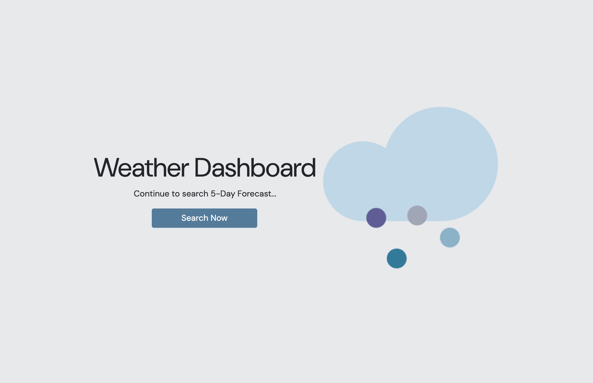

# Weather Dashboard

## Description

This website is a weather dashboard used to search weather results by city.

The code meets the below Acceptance Criteria:
* GIVEN a weather dashboard with form inputs
* WHEN I search for a city THEN I am presented with current and future conditions for that city and that city is added to the search history
* WHEN I view current weather conditions for that city THEN I am presented with the city name, the date, an icon representation of weather conditions, the temperature, the humidity, and the wind speed
* WHEN I view future weather conditions for that city THEN I am presented with a 5-day forecast that displays the date, an icon representation of weather conditions, the temperature, the wind speed, and the humidity
* WHEN I click on a city in the search history THEN I am again presented with current and future conditions for that city

## APIs
*  [Geocoding API](https://openweathermap.org/api/geocoding-api)
*  [5 Day Weather Forecast](https://openweathermap.org/forecast5)

## Usage

Deployed website is here: https://janealexadams.github.io/weather-dashboard/

Website screenshot below. 

