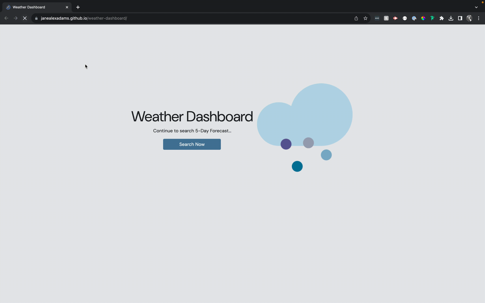

# Weather Dashboard

[](https://opensource.org/licenses/MIT)

## Description
This website is a weather dashboard used to search weather results by city. The applicatin retreives data from the [5 Day Weather Forecast](https://openweathermap.org/forecast5) API, and local storage is used to users to access their recent searches.  

## Contents
- [Usage](#usage)
- [Built With](#built-with)
- [Deployment](#deployment)
- [Questions](#questions)
- [Credits](#credits)

## Usage
To use this application, clone the repository to your local machine:
```
git clone https://github.com/janealexadams/weather-dashboard.git
```

## Built With
- [Geocoding API](https://openweathermap.org/api/geocoding-api)
- [5 Day Weather Forecast](https://openweathermap.org/forecast5)
- JavaScript
- Local Storage

## Questions
If you have any questions about the repo, please contact me via email at janealexadams@gmail.com. You can find more of my work on my GitHub, [janealexadams](https://github.com/janealexadams).

## Credits
Created by Jane Adams.

## Deployment
https://janealexadams.github.io/weather-dashboard/
